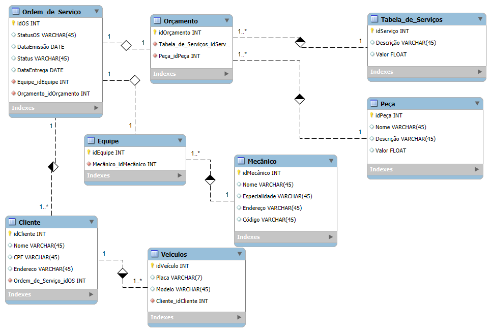

 
  

  &#xa0;

<h1 align="center">Desafio de Projeto - Projeto Conceitual de Oficina</h1>

  <a href="#memo-license">License</a> &#xa0; | &#xa0;
  <a href="https://github.com/samuelmendespy" target="_blank">SamuelMendes</a>

 

## :dart: Detalhes ##
O diretório apresenta uma diagramação modelo entidade relacionamento(ER) feita com MYSQL Workbench.
A referência do presente projeto é um sistema conceitual para uma oficina com diagram abaixo:

1 - A partir de Cliente, o diagrama mostra que um cliente tem 1 ou vários carros no registro da oficina.

2 - A oficina cria uma Ordem de Serviço(OS) para cada cliente e cada cliente pode ter várias OSs.

3 - A oficina define uma Equipe com vários Mecânicos para realizar a vistoria no veículo.

4 - A Equipe faz a vistoria e prepara o Valor da Ordem de Serviço fazendo o Orçamento.

5 - O Orçamento contém os valores das peças necessárias para o serviço e também o valor do serviço, que é calculado com base na Tabela de Serviços que contém o custo da mão de obra por serviço.

## :sparkles: Recursos ##

- :heavy_check_mark: Diagrama ER

## :rocket: Tecnologias ##

- MySQL Workbench

Made with :heart: by <a href="https://github.com/samuelmendespy" target="_blank">Samuel Mendes</a>

&#xa0;

<a href="#top">Ir para cima</a>
